<div align="center">
  
  <h1>Coral Copilot</h1>
  <p><strong>A federated, voice-operated developer agent that unifies your entire stack without ETL pipelines.</strong></p>
</div>

<br />

## The Vision
Modern software engineering is suffocated by context switching. Developers navigate GitHub for code, Linear for tracking, Slack for communication, Datadog for observability, and Hugging Face for models. When an incident occurs or a comprehensive summary is needed, engineers are forced to manually correlate data across disparate dashboards. 

Building custom ETL pipelines to aggregate this operational data takes weeks of engineering effort, introduces massive maintenance overhead, and results in stale data.

**Coral Copilot** is a unified developer assistant that interacts directly with your live operational data. Built on top of the Coral federated SQL engine and the Model Context Protocol (MCP), it allows developers to query 90+ SaaS APIs instantly using natural language or voice. **Zero ETL pipelines. Zero data duplication. Zero stale dashboards.**

---

## Key Innovations

### 1. Zero-ETL Federated Querying
We eliminate the need for complex data pipelines. When you ask a question, the LLM agent translates your intent into federated SQL. The Coral DataFusion engine executes this SQL directly against live SaaS APIs, returning real-time data without a central database.

### 2. Cross-Source Correlation Querying
Our agent actively identifies when you ask about data spanning multiple platforms. It constructs federated SQL with `JOIN`s across disparate sources (e.g., GitHub PRs and Linear issues) executing as a single query—Coral's true superpower.

### 3. Dynamic Schema Discovery via MCP
Through our integrated marketplace, adding a new source (like Hugging Face or Hashnode) is as simple as providing an API token. The agent uses the Model Context Protocol (MCP) to dynamically discover new schemas and tables at runtime, adapting to new integrations without requiring code changes. Source health is verified in real-time with live connection indicators.

### 4. Autonomous Self-Healing SQL
LLMs write bad SQL. Our backend orchestrates a self-healing loop: if a generated query contains an error, is inefficient, or exceeds API rate limits, the backend intercepts the failure and allows the agent to autonomously correct and retry the query in the background before responding to the user.

### 5. Advanced UI & Data Visualizations
- **Voice-First Experience:** Built-in OpenAI Whisper dictation allows you to query your stack while actively coding.
- **Auto-Charting:** The UI intelligently detects numeric output (like downloads or likes) and automatically renders beautiful Recharts data visualizations.
- **One-Click Export:** Every data table includes instant CSV and JSON export buttons for offline analysis.
- **Persistent History:** A sleek sidebar automatically logs your queries and their generated SQL for cross-session continuity.

---

## Business Impact
* **Accelerated Incident Response:** Engineers can instantly pull correlated data across PagerDuty, GitHub, and Datadog from a single interface.
* **Elimination of Dashboard Fatigue:** Replaces dozens of paid dashboarding tools with a single natural language interface.
* **Democratized Data Access:** Non-technical team members (PMs, QA) can query complex engineering metrics without knowing SQL or relying on data engineers.

---

## Demo & Screenshots

*(Insert link to YouTube Demo Video Here)*

| Marketplace Integration | Voice & Chat Interface |
| :---: | :---: |
|  |  |

---

## How It Works (Architecture)

The system is built on a highly decoupled architecture designed for speed and reliability:

1. **Frontend:** A Next.js 15 application providing the chat and voice interface.
2. **Backend Engine:** A FastAPI service orchestrating the GPT-4o agent.
3. **Execution Layer:** The Coral MCP Server translates SQL into live API requests.

```mermaid
flowchart LR
    subgraph Frontend["Frontend (Next.js)"]
        UI["Voice + Chat UI"]
        Market["Marketplace"]
    end

    subgraph Backend["Backend (FastAPI)"]
        LLM["GPT-4o Agent"]
        Whisper["OpenAI Whisper"]
    end

    subgraph Execution["Coral Engine"]
        MCP["Coral MCP Server"]
    end

    APIs[("90+ SaaS APIs\n(GitHub, Slack, etc)")]

    Frontend <-->|"REST / SSE"| Backend
    Backend <-->|"MCP (stdio)"| Execution
    Execution -->|"Federated SQL"| APIs

    style Frontend fill:#111,stroke:#333,stroke-width:2px
    style Backend fill:#111,stroke:#333,stroke-width:2px
    style Execution fill:#111,stroke:#333,stroke-width:2px
    style APIs fill:#222,stroke:#555,stroke-width:2px
```



---

## Getting Started

### Prerequisites
* Node.js 18+
* Python 3.12+
* Coral CLI installed and accessible on your `PATH`

### Installation

1. **Clone the repository:**
   ```bash
   git clone <repository-url>
   cd universal-dev-copilot
   make setup
   ```

2. **Configure Environment:**
   ```bash
   cp backend/.env.example backend/.env
   ```
   Open `backend/.env` and insert your API key. 
   
   **Using OpenAI (Default):**
   Provide your `OPENAI_API_KEY`.
   
   **Using Groq (Faster):**
   Set `OPENAI_API_KEY` to your `gsk_...` key, uncomment `OPENAI_BASE_URL=https://api.groq.com/openai/v1`, and set `OPENAI_MODEL=llama-3.3-70b-versatile`.

3. **Start the Application:**
   ```bash
   make dev
   ```

The frontend will be available at `http://localhost:3000` and the backend will run at `http://localhost:8000`. Open the browser, connect your preferred sources via the integrated marketplace, and begin querying your stack!

---

## License
MIT


